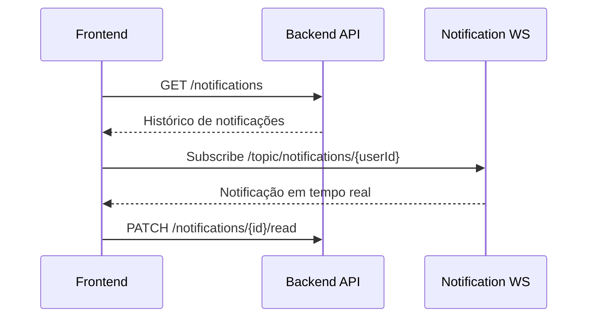
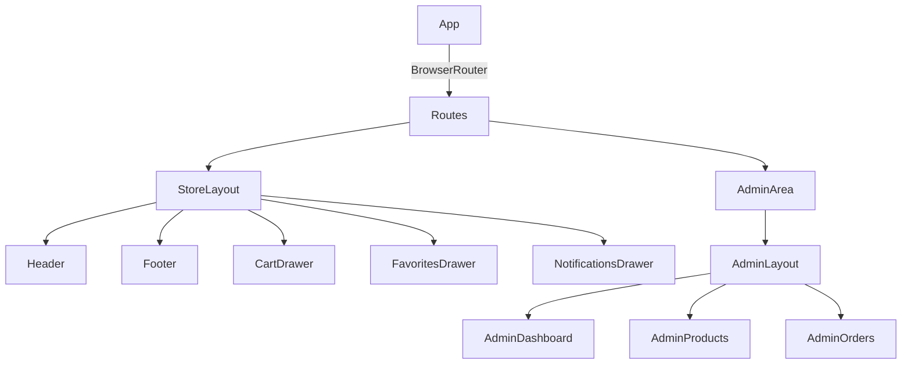

# TeeStore — Projeto Integrador Frontend

Frontend em React (Vite) para uma loja de camisetas com área do cliente e painel administrativo. O app integra com API REST e recebe notificações em tempo real via WebSocket (STOMP/SockJS).

## Principais pontos do projeto
1. **E-commerce completo**: catálogo, busca, filtros, favoritos, carrinho e checkout.
2. **Conta do cliente**: pedidos, perfil, segurança e endereços.
3. **Admin**: dashboard com KPIs, gestão de pedidos e produtos.
4. **Notificações em tempo real**: histórico via API + push via WebSocket.
5. **Autenticação**: login/registro, persistência em localStorage e refresh token automático.

## Diagramas

### Arquitetura geral
```mermaid
flowchart LR
  U[Usuário] -->|Navega| UI[React + Vite]
  UI -->|REST (Axios)| API[Backend API]
  UI -->|STOMP/SockJS| WS[Notification Service]
  API -->|Events/Status de pedidos| WS
  UI -->|localStorage| LS[(Sessão, Favoritos, Tokens)]
```

### Fluxo de notificações


### Rotas e layouts


## Funcionalidades por área

### Loja (cliente)
1. **Home**: catálogo com paginação, busca por query, filtros por categoria e ordenação.
2. **Favoritos**: persistidos em `localStorage` (`teestore_favs`) e sincronizados por evento `teestore-favs-update`.
3. **Carrinho**: drawer com itens, quantidades e subtotal, integrando com a API do carrinho.
4. **Checkout**: seleção/criação de endereço e criação de pedido.
5. **Notificações**: toasts em tempo real e drawer com histórico + status.

### Conta do usuário
1. **Meus pedidos**: timeline de status, detalhes, rastreio e filtro por status.
2. **Perfil**: dados pessoais, preferências de comunicação.
3. **Endereços**: CRUD com definição de endereço padrão.
4. **Segurança**: troca de senha, sessões ativas (UI).

### Admin
1. **Dashboard**: KPIs, receita, atividade recente e visão geral de pedidos.
2. **Pedidos**: filtros, status, exportação CSV e detalhe expandido.
3. **Produtos**: CRUD, upload de imagem e status ativo/inativo.

## Rotas principais
| Rota | Descrição | Acesso |
| --- | --- | --- |
| `/` | Home / catálogo | Público |
| `/login` | Login | Público |
| `/register` | Registro | Público |
| `/checkout` | Finalização de compra | Autenticado |
| `/orders` | Meus pedidos | Autenticado |
| `/profile` | Conta do usuário | Autenticado |
| `/admin/*` | Área administrativa | Admin |

## Estrutura de pastas
```
src/
  api/            # chamadas REST (auth, cart, orders, products, users, notifications)
  components/     # UI compartilhada (Header, Footer, Drawer, Cards, Layouts)
  context/        # AuthContext e CartContext
  hooks/          # WebSocket e notificações
  pages/          # telas da loja, conta e admin
  assets/         # imagens e estáticos
```

## Integrações com API (resumo)
| Módulo | Endpoints (exemplos) |
| --- | --- |
| Auth | `POST /auth/login`, `POST /auth/register`, `POST /auth/refresh`, `POST /auth/logout` |
| Produtos | `GET /products`, `GET /products/:id`, `GET /admin/products` |
| Carrinho | `GET /cart`, `POST /cart/items`, `PUT /cart/items/:id`, `DELETE /cart` |
| Pedidos | `POST /orders`, `GET /orders/my`, `GET /admin/orders`, `PATCH /admin/orders/:id/status` |
| Usuário | `GET /users/me`, `PUT /users/me`, `PUT /users/me/password`, `GET/POST/PUT/DELETE /users/me/addresses` |
| Notificações | `GET /notifications`, `PATCH /notifications/:id/read`, `PATCH /notifications/read-all` |

## Estado e fluxo de autenticação
1. **AuthContext** persiste `token`, `refreshToken` e `user` em `localStorage`.
2. **axiosInstance** injeta `Bearer token` em cada requisição.
3. **Refresh token** automático no interceptor de resposta (401).
4. **Logout forçado** é emitido via evento `auth:logout` quando refresh falha.

## Notificações em tempo real
- **useNotifications** conecta ao WS e escuta `/topic/notifications/{userId}`.
- Notificações são deduplicadas e mescladas com o histórico da API.
- **NotificationsDrawer** permite marcar como lidas (individual e em lote).

## Configuração do ambiente
Crie um arquivo `.env` na raiz:
```
VITE_API_BASE_URL=http://localhost:8080
VITE_WS_URL=http://localhost:8083/ws
```

## Scripts
1. `npm run dev` — inicia o servidor de desenvolvimento.
2. `npm run build` — gera build de produção.
3. `npm run preview` — pré-visualiza o build.
4. `npm run lint` — roda o ESLint.

## Como executar
1. `npm install`
2. `npm run dev`

## Observações úteis
1. **HelloWorld.jsx** é um exemplo isolado de teste de WebSocket/Kafka e não é a rota principal do app.
2. CSS é organizado com **CSS Modules** por componente/página.

Desenvolvido por Guilherme Bastos Borges.
