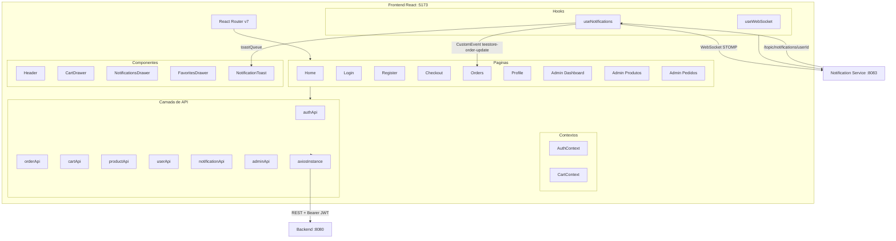
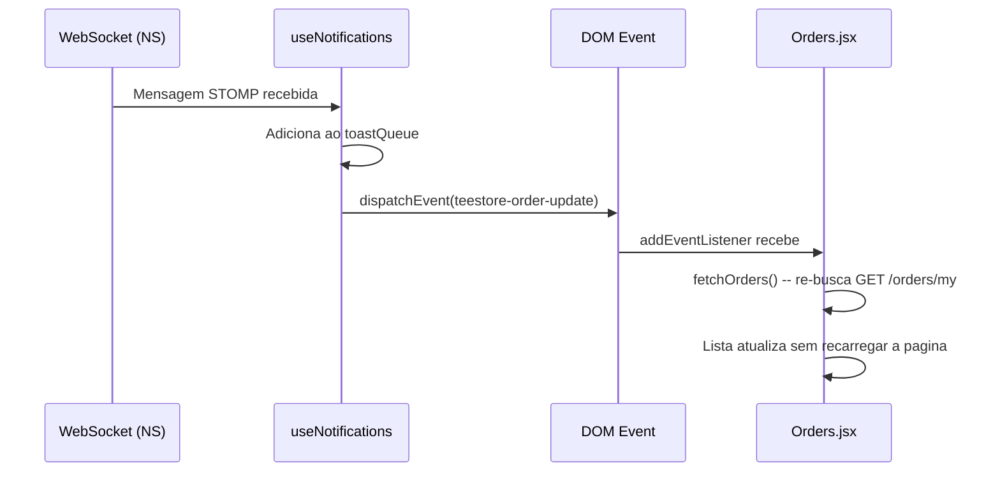
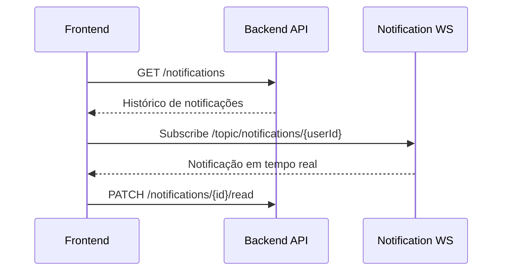
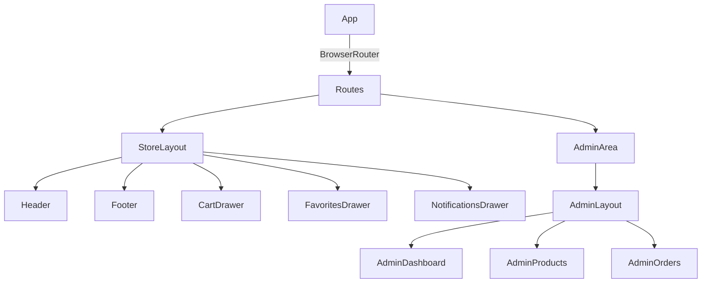

# TeeStore — Frontend

Aplicacao React (Vite) da plataforma TeeStore. Loja de camisetas com area do cliente, carrinho, checkout, acompanhamento de pedidos em tempo real e painel administrativo. Integra com API REST (Spring Boot) e recebe notificacoes via WebSocket STOMP/SockJS.

---

## Sumário

- [Arquitetura](#arquitetura)
- [Tecnologias](#tecnologias)
- [Estrutura do Projeto](#estrutura-do-projeto)
- [Páginas e Rotas](#páginas-e-rotas)
- [Componentes](#componentes)
- [Hooks](#hooks)
- [Contextos](#contextos)
- [Camada de API](#camada-de-api)
- [Notificações em Tempo Real](#notificações-em-tempo-real)
- [Variáveis de Ambiente](#variáveis-de-ambiente)
- [Como Rodar](#como-rodar)

---

## Arquitetura



---

## Tecnologias

| Tecnologia | Versao | Uso |
|---|---|---|
| React | 19 | UI |
| Vite | 8 | Build + Dev server |
| React Router | 7 | Roteamento SPA |
| Axios | 1.x | Requisicoes HTTP |
| @stomp/stompjs | 7.x | Cliente WebSocket STOMP |
| sockjs-client | 1.x | Fallback WebSocket |
| CSS Modules | — | Estilos escopados por componente |
| Geist / Geist Mono | — | Tipografia |

---

## Estrutura do Projeto

```
src/
├── api/
│   ├── axiosInstance.js       # Axios com interceptors JWT + refresh automatico
│   ├── authApi.js             # login, register, refresh, logout
│   ├── cartApi.js             # getCart, addItem, updateItem, removeItem, clear
│   ├── orderApi.js            # createOrder, getUserOrders, getOrderById
│   ├── productApi.js          # getProducts, getProductById
│   ├── userApi.js             # getMe, updateMe, updatePassword, addresses
│   ├── notificationApi.js     # getNotifications, markAsRead, markAllAsRead
│   └── adminApi.js            # products CRUD, orders, dashboard
│
├── context/
│   ├── AuthContext.jsx        # Estado global de autenticacao + refresh token
│   └── CartContext.jsx        # Estado global do carrinho
│
├── hooks/
│   ├── useNotifications.js    # WebSocket STOMP + REST sync + toastQueue
│   └── useWebSocket.js        # Hook generico de WebSocket
│
├── components/
│   ├── Header/                # Navegacao, busca, carrinho, notificacoes, favoritos
│   ├── CartDrawer/            # Drawer lateral do carrinho
│   ├── NotificationsDrawer/   # Drawer lateral de notificacoes
│   ├── FavoritesDrawer/       # Drawer lateral de favoritos
│   ├── NotificationToast/     # Pop-ups de notificacao em tempo real
│   ├── ProductCard/           # Card de produto na listagem
│   ├── Footer/                # Rodape
│   ├── AdminLayout/           # Layout do painel admin
│   └── ProtectedRoute.jsx     # Guarda de rota (autenticacao + ADMIN)
│
└── pages/
    ├── Home/                  # Listagem de produtos + busca + paginacao
    ├── Login/                 # Formulario de login
    ├── Register/              # Formulario de cadastro
    ├── Checkout/              # Finalizacao de pedido
    ├── Orders/                # Historico de pedidos (atualiza em tempo real)
    ├── Profile/               # Perfil, dados pessoais, enderecos, seguranca
    └── Admin/
        ├── Dashboard/         # Metricas: receita, pedidos, usuarios, produtos
        ├── Products/          # CRUD de produtos com upload de imagem
        └── Orders/            # Gestao de pedidos com filtro por status
```

---

## Páginas e Rotas

| Rota | Pagina | Auth | Descricao |
|---|---|---|---|
| `/` | Home | — | Listagem de produtos com busca e paginacao |
| `/login` | Login | — | Formulario de autenticacao |
| `/register` | Register | — | Cadastro de novo usuario |
| `/checkout` | Checkout | Usuario | Finalizacao de pedido |
| `/orders` | Orders | Usuario | Historico com status em tempo real |
| `/profile` | Profile | Usuario | Perfil, senha, enderecos, favoritos |
| `/admin` | Admin Dashboard | Admin | Metricas e resumo da loja |
| `/admin/products` | Admin Products | Admin | Listagem, criacao, edicao, upload de imagem |
| `/admin/orders` | Admin Orders | Admin | Gestao de pedidos com filtro por status |

---

## Componentes

**Header**
Barra de navegacao com logo, busca, icones de favoritos, carrinho e notificacoes (com badge de nao lidas). Abre drawers laterais ao clicar em cada icone.

**CartDrawer**
Drawer lateral com itens do carrinho, quantidades, totais e botao de ir para checkout.

**NotificationsDrawer**
Drawer lateral com historico de notificacoes do usuario. Marca como lida ao abrir.

**FavoritesDrawer**
Drawer lateral com produtos favoritados (persistidos em localStorage).

**NotificationToast**
Pop-ups de notificacao que aparecem automaticamente no canto da tela quando chega uma mensagem via WebSocket. Auto-dismiss com temporizador.

**ProductCard**
Card de produto com imagem, nome, preco, tamanhos disponiveis e botao de adicionar ao carrinho.

**ProtectedRoute**
HOC que redireciona para `/login` se o usuario nao estiver autenticado, ou para `/` se nao for ADMIN (para rotas administrativas).

---

## Hooks

### `useNotifications(userId)`

Gerencia o ciclo completo de notificacoes:

1. Busca notificacoes persistidas via `GET /notifications`
2. Abre conexao WebSocket STOMP em `ws://localhost:8083/ws`
3. Se inscreve em `/topic/notifications/{userId}`
4. Quando chega mensagem:
   - Adiciona ao estado `notifications` (drawer)
   - Enfileira em `toastQueue` (pop-up)
   - Dispara `CustomEvent('teestore-order-update')` para re-fetch automatico em `Orders.jsx`
   - Sincroniza com o banco apos 1s (para pegar ID real persistido)
5. Reconexao automatica a cada 5s em caso de queda

```
Retorno: { notifications, unreadCount, connected, markAllRead, refresh, toastQueue, dismissToast }
```

### Atualização Automática de Pedidos



---

## Contextos

**AuthContext**
Gerencia estado de autenticacao global:
- Persiste `accessToken`, `refreshToken`, `user` no `localStorage`
- `axiosInstance` usa interceptor para incluir `Authorization: Bearer {token}` automaticamente
- Em caso de 401, tenta refresh token antes de redirecionar para login
- Expoe `user`, `login`, `logout`, `isAdmin`

**CartContext**
Gerencia estado do carrinho global:
- Sincroniza com `GET /cart` ao fazer login
- Expoe `cartItems`, `cartCount`, `addToCart`, `removeFromCart`, `clearCart`

---

## Camada de API

Todos os modulos de API usam o `axiosInstance` centralizado com:
- `baseURL` configurada via `VITE_API_URL`
- Interceptor de request: injeta `Authorization: Bearer {token}`
- Interceptor de response: em 401, tenta `POST /auth/refresh` e reexecuta a requisicao original

```javascript
// axiosInstance.js — fluxo de refresh automatico
instance.interceptors.response.use(
  (response) => response,
  async (error) => {
    if (error.response?.status === 401 && !originalRequest._retry) {
      originalRequest._retry = true;
      const newToken = await refreshAccessToken();
      originalRequest.headers.Authorization = `Bearer ${newToken}`;
      return instance(originalRequest);
    }
    return Promise.reject(error);
  }
);
```

---

## Notificações em Tempo Real

O fluxo completo de ponta a ponta:

```
Usuario faz pedido
       |
Backend publica order.created no Kafka
       |
Logistics Service processa (8s)
       |
Kafka: order.status.updated SHIPPED
       |
Notification Service -> WebSocket -> browser
       |
+------+------+
|             |
Toast popup   Orders.jsx re-faz fetch
aparece       e atualiza status na tela
```

Nao e necessario recarregar a pagina. Tudo acontece automaticamente via `CustomEvent` + `addEventListener`.

---

## Variáveis de Ambiente

Copie `.env.example` para `.env`:

```env
VITE_API_URL=http://localhost:8080
VITE_WS_URL=http://localhost:8083/ws
```

---

## Como Rodar

**Pre-requisitos:** Node.js 18+, npm ou yarn

```bash
# 1. Instale as dependencias
cd Projeto-Integrador-Frontend
npm install

# 2. Configure as variaveis
cp .env.example .env

# 3. Execute em modo desenvolvimento
npm run dev
```

O app abre em `http://localhost:5173`.

**Build para producao:**
```bash
npm run build
npm run preview
```

---

## Acesso Admin

```
Email:  admin@teestore.com
Senha:  admin123
```

---

*Projeto Integrador — Desenvolvido por Victor Hugo, Josue Felix e Guilherme Bastos*

## Principais pontos do projeto
1. **E-commerce completo**: catálogo, busca, filtros, favoritos, carrinho e checkout.
2. **Conta do cliente**: pedidos, perfil, segurança e endereços.
3. **Admin**: dashboard com KPIs, gestão de pedidos e produtos.
4. **Notificações em tempo real**: histórico via API + push via WebSocket.
5. **Autenticação**: login/registro, persistência em localStorage e refresh token automático.

## Diagramas

### Arquitetura geral
```mermaid
flowchart LR
  U[Usuário] -->|Navega| UI[React + Vite]
  UI -->|REST (Axios)| API[Backend API]
  UI -->|STOMP/SockJS| WS[Notification Service]
  API -->|Events/Status de pedidos| WS
  UI -->|localStorage| LS[(Sessão, Favoritos, Tokens)]
```

### Fluxo de notificações


### Rotas e layouts


## Funcionalidades por área

### Loja (cliente)
1. **Home**: catálogo com paginação, busca por query, filtros por categoria e ordenação.
2. **Favoritos**: persistidos em `localStorage` (`teestore_favs`) e sincronizados por evento `teestore-favs-update`.
3. **Carrinho**: drawer com itens, quantidades e subtotal, integrando com a API do carrinho.
4. **Checkout**: seleção/criação de endereço e criação de pedido.
5. **Notificações**: toasts em tempo real e drawer com histórico + status.

### Conta do usuário
1. **Meus pedidos**: timeline de status, detalhes, rastreio e filtro por status.
2. **Perfil**: dados pessoais, preferências de comunicação.
3. **Endereços**: CRUD com definição de endereço padrão.
4. **Segurança**: troca de senha, sessões ativas (UI).

### Admin
1. **Dashboard**: KPIs, receita, atividade recente e visão geral de pedidos.
2. **Pedidos**: filtros, status, exportação CSV e detalhe expandido.
3. **Produtos**: CRUD, upload de imagem e status ativo/inativo.

## Rotas principais
| Rota | Descrição | Acesso |
| --- | --- | --- |
| `/` | Home / catálogo | Público |
| `/login` | Login | Público |
| `/register` | Registro | Público |
| `/checkout` | Finalização de compra | Autenticado |
| `/orders` | Meus pedidos | Autenticado |
| `/profile` | Conta do usuário | Autenticado |
| `/admin/*` | Área administrativa | Admin |

## Estrutura de pastas
```
src/
  api/            # chamadas REST (auth, cart, orders, products, users, notifications)
  components/     # UI compartilhada (Header, Footer, Drawer, Cards, Layouts)
  context/        # AuthContext e CartContext
  hooks/          # WebSocket e notificações
  pages/          # telas da loja, conta e admin
  assets/         # imagens e estáticos
```

## Integrações com API (resumo)
| Módulo | Endpoints (exemplos) |
| --- | --- |
| Auth | `POST /auth/login`, `POST /auth/register`, `POST /auth/refresh`, `POST /auth/logout` |
| Produtos | `GET /products`, `GET /products/:id`, `GET /admin/products` |
| Carrinho | `GET /cart`, `POST /cart/items`, `PUT /cart/items/:id`, `DELETE /cart` |
| Pedidos | `POST /orders`, `GET /orders/my`, `GET /admin/orders`, `PATCH /admin/orders/:id/status` |
| Usuário | `GET /users/me`, `PUT /users/me`, `PUT /users/me/password`, `GET/POST/PUT/DELETE /users/me/addresses` |
| Notificações | `GET /notifications`, `PATCH /notifications/:id/read`, `PATCH /notifications/read-all` |

## Estado e fluxo de autenticação
1. **AuthContext** persiste `token`, `refreshToken` e `user` em `localStorage`.
2. **axiosInstance** injeta `Bearer token` em cada requisição.
3. **Refresh token** automático no interceptor de resposta (401).
4. **Logout forçado** é emitido via evento `auth:logout` quando refresh falha.

## Notificações em tempo real
- **useNotifications** conecta ao WS e escuta `/topic/notifications/{userId}`.
- Notificações são deduplicadas e mescladas com o histórico da API.
- **NotificationsDrawer** permite marcar como lidas (individual e em lote).

## Configuração do ambiente
Crie um arquivo `.env` na raiz:
```
VITE_API_BASE_URL=http://localhost:8080
VITE_WS_URL=http://localhost:8083/ws
```

## Scripts
1. `npm run dev` — inicia o servidor de desenvolvimento.
2. `npm run build` — gera build de produção.
3. `npm run preview` — pré-visualiza o build.
4. `npm run lint` — roda o ESLint.

## Como executar
1. `npm install`
2. `npm run dev`

## Observações úteis
1. **HelloWorld.jsx** é um exemplo isolado de teste de WebSocket/Kafka e não é a rota principal do app.
2. CSS é organizado com **CSS Modules** por componente/página.

Desenvolvido por Guilherme Bastos Borges.
